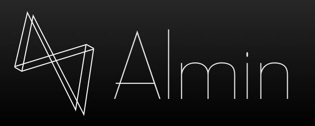

# Almin.js official logo



## Copy & Paste Code


```markdown

````


```markdown

```

## License

Created by [@azu](https://github.com/azu)

<p>
  <a rel="license"
     href="http://creativecommons.org/publicdomain/zero/1.0/">
    
  </a>
  <br />
  To the extent possible under law,
  <a rel="dct:publisher"
     href="https://github.com/azu">
    <span property="dct:title">@azu</span></a>
  has waived all copyright and related or neighboring rights to
  <span property="dct:title">Almin.js logo</span>.
</p>

## Credits

Gatsby Font by [Casady & Greene](http://moorstation.org/typoasis/designers/casady_greene/index.htm)